## Media Players / Video Editors

Media players are hardware or software devices used to play multimedia files e.g audio files, video files, image files and digital media files. These tools play files stored on a storage device, on a disc or streamed from the internet. 

Media players support various file formats e.g MP3, WAV, AVI,MP4 and many more with the ability to organise media files into music, videos and photos. This helps you to sort your files in your playlist. Media players allows the user to playback and control the progress of their file by starting, pausing, stopping, volume adjustment, fast fowarding, playbacks, subtitles etc.

Video Editors are software programs that transforms raw video footage into an organised story. Video editors helps you to crop, trim or split your video into small clips, adding enhancements etc and then allows you to download your editied video as an MP4 to save and share with others. Video editors also allow the user to remove unwanted background noise from scenes and upload their preffered music to the video. A good video editor should have the ability to add feel and animated effects to the editted video.

If you intend to create promotional, youtube tutorials, stories and educational videos, then you need to learn how to edit the videos as most often, you will need to trim your videos as well as adding effects to your videos.

This documentation will major around common media players and how to install them in Ubuntu Desktop and its derivatives.

### 1. MPV Media Player

MPV Media Player is completely free open source software that is cross-platform in nature for the command line. Its preffered by many users because of its ability to support a wide range of media file formats, audio, video codecs and subtitle types. It has powerful scripting capabilities which makes the player a Swiss amy knife as it can do almost anything.

MPV media player is based on OpenGL, Vulkan and D3D11 for high quality video output e.g color management, frame timing, interpolation, HDR. It is built in C programming language which makes it highly embeddable and easily integratable into other applications. 

MPV is purely commandline based but provides an On Screen Controller on top of the video for basic control. MPV leverages most hardware decoding APIs on all platforms its installed on.

MPV media player is based on MPlayer and mplayer2 and has special input URL types available to read input from several sources. It has a fully configurable command-driven control layer to allow the user to control MPV using the keyboard, mouse or remote control.

#### Features

As seen on the brief introduction, its sufficient to note that MPV Media Player is rich in features as summarised below.

- MPV media player is free and open source.

- Supports multiple video file formats, audio and video codecs.

- It is cross-platform in nature.

- The user can take screenshots using the screenshot input mode command on a currently played file. The default **S** takes screenshots without subtitles while **s** includes subtitles.

- MPV has a terminal status line that shows the playback status on the terminal. e.g V for video and A for audio, current time position, total file duration, playback speed, playback percentage, encoding state,  display sync state, dropped frames and cache state.

- MPV Media Player has the ability to reduce latency by disabling features which increase latency because it is optimized for normal video playback.

- MPV Media Player has the ability to store a playback of a currently playing file and resume to it the next time that file is played.

- MPV Media Player supports many network protocols but the protocol prefix must always be specified e.g HTTP, HTTPS, ytdl, smb, etc

- MPV Media Player has no official GUI but has the On Screen Controller which acts as pseudo GUI mode for minimal control over keyboard, mouse or remote control.

- Supports multiple audio output drivers e.g pulse, openal, audiounit for iOS, pipewire, sdl, wasapi etc.

- Supports multiple video output drivers e.g gpu, xv, direct3d, sdl etc

- Supports multiple audio filters that allows the user to modify the audio stream and its properties e.g lavcac3enc, tempo, pitch etc

- MVP Media Player also supports multiple video filters to help the user to modify the video stream and its properties e.g --vf, colormatrix etc

- Supports many encoding formats and codecs making it easy to encode files from one format/codec to another.

- MPV Media Player is controlled with commands and properties and the user can interact with the player using key bindings, OSD, JSON IPC, client API and the classic slave mode.

For more details on this amazing Media Player, please visit the [MPV Manual](https://mpv.io/manual/master/).

#### Installation and Usage

To install MPV Media Player on Ubuntu Desktop, follow the steps below.

##### Step 1 : Download MPV Media Player

Navigate to the [MPV Github releases](https://github.com/mpv-player/mpv/releases) page for the latest MPV media player release if you would wish to build the application from the source code.

The MPV media player packages are available in Ubuntu APT package index. The package can be searched using the commands below which will list for you the mpv packages available for installation.

```bash
apt search mpv
apt list | grep mpv
apt-cache search mpv
```

##### Step 2: Install MPV Media Player

MPV Media Player can be installed directly using the APT package manager. Navigate to your terminal and run the command below:

```bash
sudo apt install mpv
```

##### Step 3: Launch MPV Player

After successful installation, you can launch the application by navigating to **Application menu** >> **Activities** then search for **MPV Media Player** 

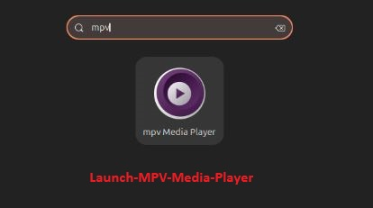

Alternatively you can launch MPV Media Player on the command terminal by the command below.

```bash
mpv
```

Launching MPV using the mpv command doesnt open anything as the command expects you to supply either the path to your video/audio file, URL and so on. We will examine this in the usage.

##### Step 4: MPV Media Player Usage

To stream a video/audio from URL source, copy the video/audio URL and launch it on the command terminal as shown below.

```bash
mpv <url to your video/audio>
## example ##
mpv https://www.youtube.com/watch?v=HEBvdSI0wGQ
```

This opens the video stream as below.

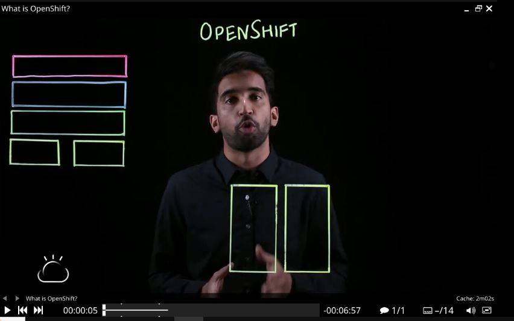

If the user desires to start the stream at a specific time, he can do this by running the command below.

```bash
mpv --start=120 https://www.youtube.com/watch?v=HEBvdSI0wGQ
```

The command above will start your stream at the second minute.

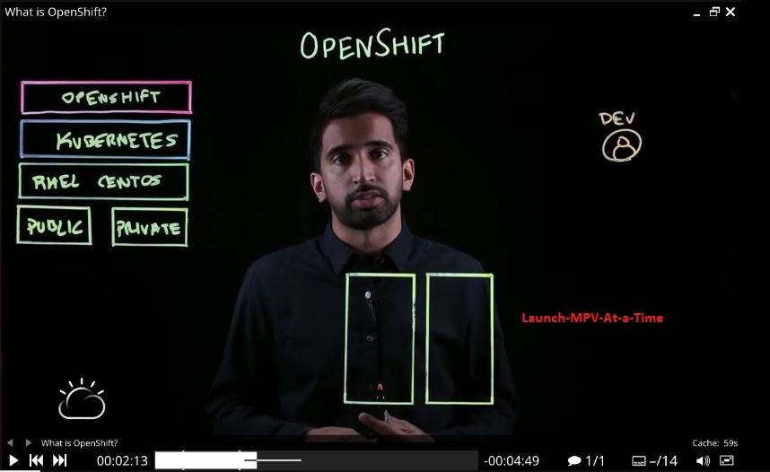

To loop through the video, run the command:

```bash
mpv --loop <your URL or /path/to/your/video.mp4
```

To play a video in full screen mode

```bash
mpv --fs /path/to/your/video.mp4
```

To adjust volume of the video

```bash
mpv --volume=75 /path/to/your/video.mp4
```

To see a list of options you can use with MPV Media Player

```bash
mpv --help
```

To play your audio file in the background as you work, add an ampersand at the end of the command.

```bash
mpv /path/to/audio.mp3 &
```

To read more about MPV Media Player, access the [MPV-Player Github page](https://github.com/mpv-player/mpv)

### 2. SMPlayer

SMPlayer is a free media player for Windows, Linux and Mac OS with built-in codecs which enables the player to play all video and audio formats without needing installation of other external codecs. SMPlayer distinguishes itself from other media players due to its capability to remember the settings of all the files you play on the player. 

SMPlayer is a GUI based with ability to play Youtube videos and download titles.

#### Features

SMPlayer distinguishes itself as key media player due to some of the features highlighted below.

- SMPlayer supports majority of the well known media formats e.g avi, mp4, mkv, mpeg, mov, divx, h.264 due to its built-in codecs.

- SMPlayer has support for Youtube with a plugin to help the user to search for Youtube videos.

- Supports several skins and icon themes to change the way player looks like.

- Has ability to search and download subtitles from open subtitles website.

- Supports video and audio filters.

- Ability to tweak the video/audio playback speed, audio adjustment and subtitle delays, video equalizer etc

- Available in multiple languages

- Available for Windows, Linux and Mac OS.

- SMPlayer is free and opensource licensed under GPL license.

- Uses MPlayer as its playback engine. 

#### Installation and Usage

SMPlayer source code is avaliable for Downloads on the official [SMPlayer Downloads page](https://www.smplayer.info/en/downloads) which maintains packages for Windows, Linux and Mac OS. 

To install SMPlayer on Ubuntu Desktop, carryout the steps below. The latest releases for SMPlayer are versioned at SMPlayer official [Github page](https://github.com/smplayer-dev/smplayer/releases). 

##### Step 1 : Add the SMPlayer repository

To easily install and manage the SMPlayer on Ubuntu, you need to add the official SMPlayer repositories on your system. This also helps to include some missing and updated libraries that might not already exist in the prebuilt SMPlayer libraries. Run the command below.

```bash
sudo add-apt-repository ppa:rvm/smplayer 
```

Note : The official repository might not be supported in latest version of Ubuntu distributions i.e from **Ubuntu 24.XX** 

Then update your system for the new changes to be effected.

```bash
sudo apt -y update 
```

If the method above throws an error, then remove the PPA and install SMPlayer directly from the packages maintained in the APT package index.

```bash
sudo add-apt-repository --remove ppa:rvm/smplayer
```

##### Step 2 : Install SMPlayer on Ubuntu

SMPlayer media player packages are available for installation on Ubuntu's APT package index. To install SMPlayer on Ubuntu Desktop, execute the following command.

```bash
sudo apt install smplayer smplayer-themes
```

##### Step 3: Launch SMPlayer on Ubuntu

To launch SMPlayer on Ubuntu navigate to **Applications Menu** >> **Show Apps** >> Search for **SMPlayer** 

Alternatively using the command prompt issue the command.

```bash
smplayer
```

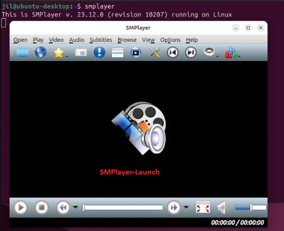

##### Step 4 : SMPlayer Usage

To open your video/audio file, navigate to the **Menu** >> **Open** >> **File** to navigate to where your video/audio file is located. You could also drag-and-drop the file to the player to play it.

When playing your video/audio file, you can **Pause**, **Stop** and even play the **Next** or **Previous**. To Stop the file, you can press **S** on the command line.

As your Video/audio file is playing, you can control the volume by the volume slider using your mouse, or alternatively use the scroll wheel on your mouse. You could also use keyboard shortcuts i.e **+/-** or **Up/Down** to adjust the volume of the file you are playing.

To jump to a specific part of your video/audio file, you can use the **seek bar** or keyboard shortcuts like **Left/Right** arrows or **PgUp/PgDn** 

If the video you are watching is on a language you dont understand, you can load subtitles by navigating to **Subtitles** >> **Load Subtitle File** 

You can create a playlist by adding multiple files by navigating to **Open** >> **File** then browsing to the location of your multiple files. The Playlist can then be managed on **Playlist** menu options.


The video Aspect ration can be adjusted from **Video** >> **Aspect ratio**. To play video with old formats, navigate to **Video** >> **Deinterlace** 

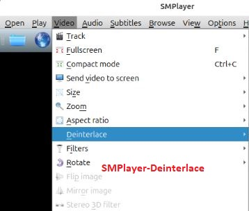

To stream your favorite audio/video from Youtube, copy the file URL and navigate to **Open** >> **URL** and paste the URL link.


To take the screenshots from your playing video, **press Ctrl + S**. To watch your video in **Full Screen Mode**, go to **Video** then **Fullscreen** or by simply pressing **F** on the keyboard.


To view a video from Youtube video, navigate to **View** >> **YouTube browser**

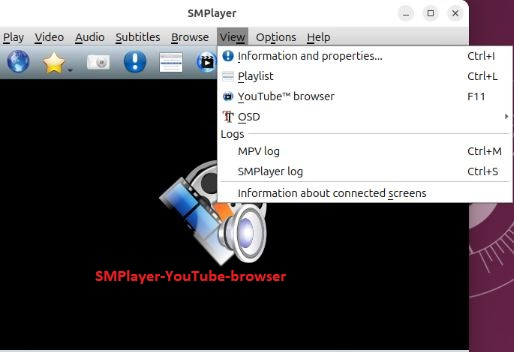

To read more on SMPlayer, navigate to SMPlayer [Github Page ](https://github.com/smplayer-dev/smplayer) 

### 3. Gnome Videos

The official media player for the GNOME desktop environment is Gnome Videos formerly known as Totem. This player uses Clutter and GTK+ toolkits. All GNOME versions from 2.10 has the player included by default making it the defacto media player for all GNOME desktop environments. For playback, Videos uses GStreamer framework or can be configured to use Xine libraries instead of GStreamer. The developers have enhanced GStreamer to be the core framework for playback services in Gnome Videos dropping the support for Xine backend.

Videos automatically gathers all your videos in one place and all the user has to do is pick his movie and play it. Another key feature is the players ability to group several video channels making the accessibility of your videos very easy. Additionally, the media player has an easy to use user interface. 

#### Features

Some of the features associated with Gnome Videos are highlighted below.

- GStreamer allows Gnome Videos to support a large number media formats.

- The Gnome Videos configured to use Xine has a better encrypted DVD playback support and DVD navigation support.

- Its easily integrated with GNOME desktop environment and its file manager i.e GNOME files.

- Supports a huge number of plugins which allows the player to support multiple media formats.

- Supports multiple playlist formats e.g M3U, XSPF, SMIL, Windows Media Player playlists, RealAudio etc.

- Supports Full-screen video playback with ability to control the video brightness, contrast and saturation.

- Supports stereophonic sound.

- Could also be supported remotely on computers with an infrared port using LIRC.

- Supports loading of external subtitles manually or automatically using the command line interface.

- Has an easy to use interface.

- Supports direct playback from online video channels

- Supports multiple video decoding mechanisms e.g UVD, PureVideo, QuickSync etc for video acceleration. 

#### Installation and Usage

Gnome Videos package is available for installation from the APT package index. To install the media player carryout the following steps.

##### Method 1 : Install Gnome Videos via Flathub

Flathub is a centralised repository that contains multiple software that Linux users can install in their distributions. 

To use Flathub, you must install it in your system first if not already installed.

```bash
sudo apt install flatpak
```

Add the Flathub repository.

```bash
 sudo flatpak remote-add --if-not-exists flathub https://flathub.org/repo/flathub.flatpakrepo
```

For a GUI to manage Flatpak applications, you can **optionally** install GNOME Software plugin.

```bash
sudo apt install gnome-software-plugin-flatpak
sudo reboot 
```

Search for the application in the Flathub repository

```bash
sudo flatpak search totem
```

Install the Gnome Videos application

```bash
sudo flatpak install flathub org.gnome.Totem
```

Agree with the onscreen prompts to install the application. Once the installation is complete, run GNOME Videos by the command below.

```bash
flatpak run org.gnome.Totem
```

The interface looks like this.

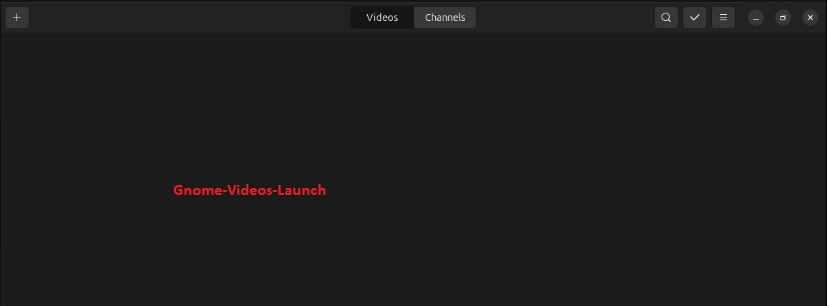

##### Method 2 : Installing GNOME Videos via APT package manager

GNOME Videos packages are available for installation from the APT package manager. Install GNOME Videos with the command below.

```bash
sudo apt install totem 
```

Launch GNOME Videos on command line by the command.

```bash
totem
```

To play a video stored *locally* or from the *web*, navigate to the **+** icon on the top left corner of the user interface and click on the icon. This opens a drop down where the user can choose either **Adding Local Video** or **Adding Web Video** 

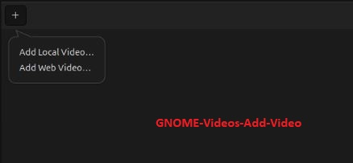

Copy the link of your video/audio file and paste the link under Add Web Video, Click Add to add your video to your playlist. 

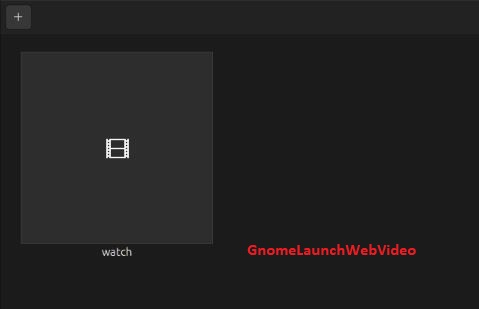

Click *watch*  to start watching your video. 

To change how fast or slow a movie is played, navigate to the bottom right corner, and under the menu button below the video area, in the speed section select your preffered speed.

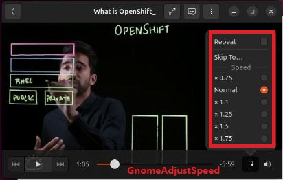

To adjust Volume navigate to the bottom right corner, press the volume button below the video area and drag the slider to adjust volume.


To change to another video, simply press the Arrow back button in the upper left corner. To select a different language, press the menu button in the top right corner and select your preffered language.

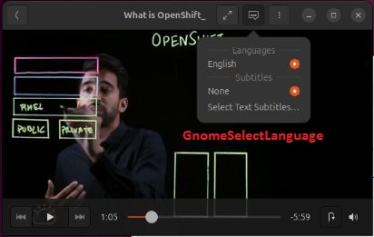

To manually load external subtitles for a video file, navigate to the menu button in the top right corner of the window and select **Subtitles** >> **Select Text Subtitles** then navigate to the where the file containing subtitles is located.

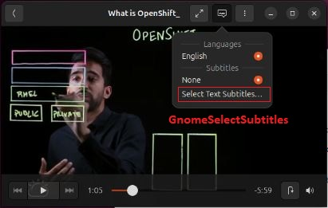

The channels section on the interface shows a number of network videos resources, whether from the internet of locally e.g UPnP, DLNA shares, movie trailers, new stories and other so on.

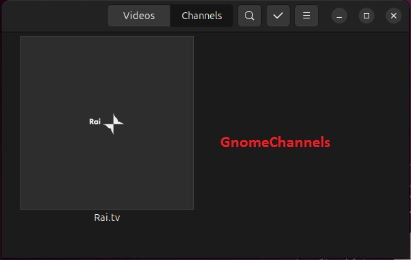

To read more on GNOME Videos, visit the [Github page](https://github.com/GNOME/totem) 

### 4. Haruna Media Player

Haruna is an open source media player built with Qt/QML on top of libmpv sponsored by KDE Organisation. Haruna Media Player easily integrates with KDE Environment and particularly KDE Plasma.The installation packages are available for Mac, Windows and Linux distributions and should work natively without additional setup.

#### Features

Haruna Media Player comes in handy with some of the following features.

- Has an automatic playlist that is populated with files from the same folder. The playlist comes in three different styles i.e normal, thumbnails and compact.

- Supports configurable keyboard shortcuts to control different actions.

- Video can easily be previewed on seek/progress bar.

- Supports online videos from Youtube i.e youtube-dl.

- Supports custom mpv commands.

- The user can quickly jump to the next chapter by middle clicking on the progress bar.

- The user can easily toggle between playlists with a mouse-over.

- The user can auto skip chapter containing certain key words.

- It has an auto hide for menubar and toolbar.

- Supports theming by allowing the user to change the color schemes as well as widgets.

- Supports subtitle handlings.

- Haruna is open source and cross-platform in nature with support for Mac, Windows and Linux.

#### Installation and Usage

Haruni is already available on majority of Linux distributions package managers. It can also be installed via [Flatpak](https://flathub.org/apps/details/org.kde.haruna) from Flathub. In addition, it can be installed directory from [Discover](https://haruna.kde.org/download/#ZgotmplZ) , [GNOME Software]([Download - Haruna](https://haruna.kde.org/download/#ZgotmplZ)), 

To install Haruni on Ubuntu Desktop carryout the steps below.

##### Method 1 : Install Haruni via Flatpak

Begin by installing Flatpak on your Ubuntu system.

```bash
sudo apt install flatpak
```

Then install GNOME Software Flatpak plugin. This plugin allows the users to install applications on Ubuntu without needing the commandline. Run the command below.

```bash
sudo apt install gnome-software-plugin-flatpak
```

Add the Flathub repository which contains all the Flatpak applications by the command below.

```bash
flatpak remote-add --if-not-exists flathub https://dl.flathub.org/repo/flathub.flatpakrepo
```

Install Haruna by the command below.

```bash
sudo reboot
sudo flatpak install flathub org.kde.haruna
```

Agree to the defaults by pressing Enter button on your keyboard to install Haruna on Ubuntu system.

Once installation is successful, Run the application by the command below.

```bash
flatpak run org.kde.haruna
```

The command launches Haruna User Interface.

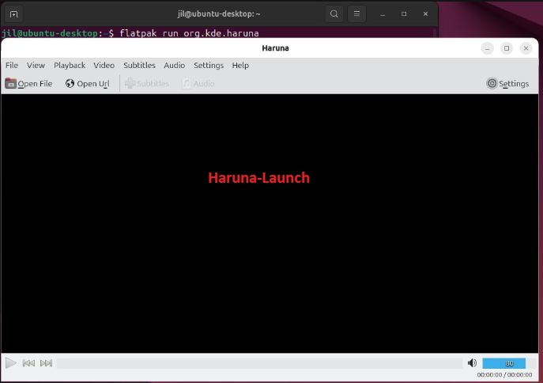

##### Method 2: Install Haruna via APT package manager

Haruna packages are available for installation from APT Package index. These are usually the latest packages for installation.

To install Haruna via APT Package Manager, issue the command below.

```bash
apt search haruna
sudo apt install haruna
```

Launch the application by navigating to **Applications Menu** >> **Show Apps** then search for **Haruna** 

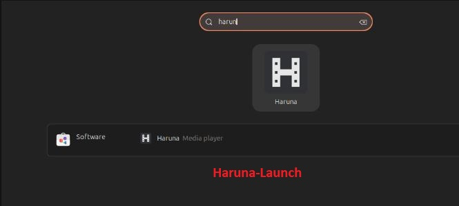

Double click on the icon to launch Haruna User Interface.

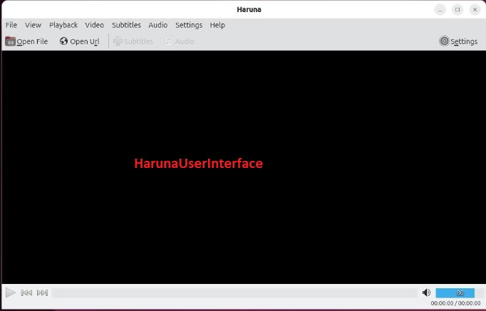

To select a Video stored locally, navigate to **Open File** then select the location of your movie. If you choose to use the command line, you can open the video with the command below.

```bash
haruna /path/to/your/video.mp4
```

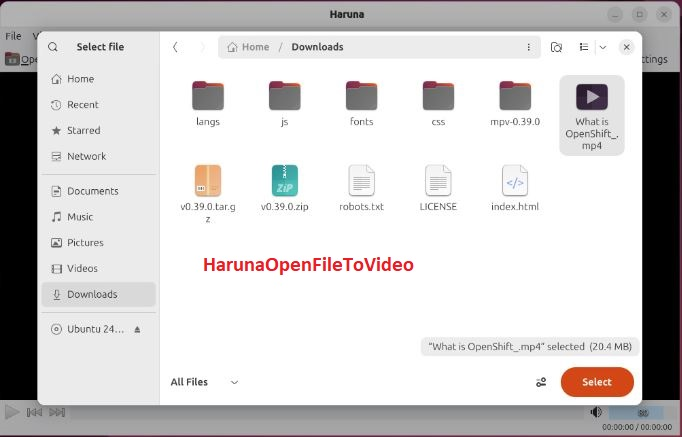

Click **Select** after choosing your mp4 file to play the video.

If your video is from a URL link, choose **Open Url** then you will be required to supply the URL to your video.

For playback and all the controls associated with playback, Select **Playback** on the menu. Some of the actions you can achieve include Playing / Pausing a video, Play the Next video, playing the Previous movie, increasing/decreasing the speed of the playbacks, seeking and so on.

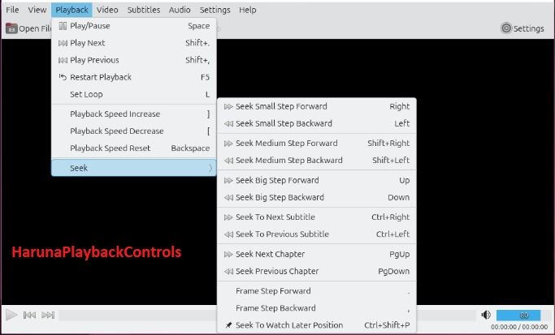

To ***Zoom in/out/Reset *** a movie, navigate to **Video** on the menu. Here the user can also **Screenshot** a scene in a movie, ***Move video to the Left or Right, Up or Down*** and also perform several **Adjustments** such increasing the video **contrast, brightness, saturation**, and so on.

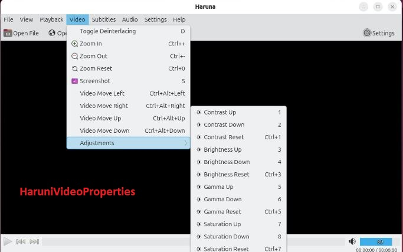

For **Subtitles properties** like increasing the font size, decreasing the font size, moving subtitles Up or Down etc navigate to Subtitles and adjust your subtitles accordingly.

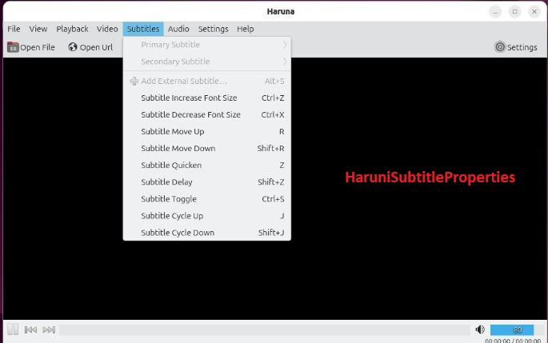

For **Audio** properties like Muting a video, increasing or decreasing the volume etc, navigate to Audio for more settings.

The **Settings Tab** has other important aspects you can set for your movies like configuring mouse settings, creating shortcuts for easier management of the movies, custom mpv commands you could use, and many more settings you can set yourself.

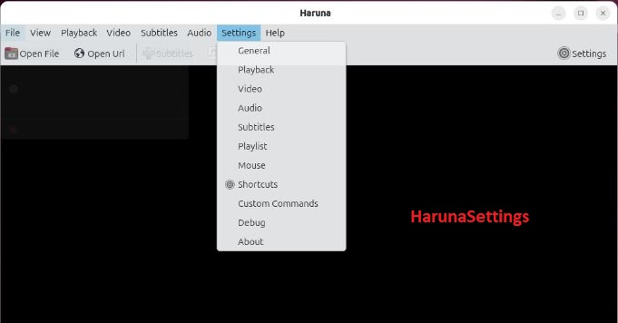

Read more about Haruna on the Official [Github Page](https://github.com/KDE/haruna) 

### 5. QMPlay2 - Qt Media Player 2

QMPlay2 is an open source multiplatform video and audio player that plays all formats supported by FFmpeg, libmodplug and SFX based on QT. QMPlay2 supports Audio CD, raw files, Rayman 2 music and chiptunes. QMPlay2 is available for installation for GNU/Linux, OS X and Windows systems.

QMPlay2 is a lightweight media player that helps the users to listen to online radio stations allowing the users to download videos from the internet. It has a fully customizable interface and can play online audio streams. Qt Media Player 2 contains Youtube. MyFreeMP3 and internet radio browsers.

#### Features

Features associated with QMPlay2 include:-

- Supports hardware acceleration e.g VDPAU and VA-API via OpenGL and Vulkan video output.

- Hardware accelerated video decoding uses its own video filtering

- Deinterlacing is automatically enabled when corresponding videos are detected.

- Supports split channels and can be controlled via mpris D-Bus.

- The interface has widgets that can easily be switched on or off, making the player customizable.

- Can be installed in Linux, Windows and macOS.

- Has a media browser that helps the user to search for his/her favorite song on the internet.

- Multimedia keys works automatically without requiring manual configuration.

- Its interface is built on Qt.

- Enables the spherical view of YouTube 360 degrees videos.

- Supports most codecs used by FFmpeg

#### Installation and Usage

To install QMPlay2 on Ubuntu Desktop and its derivatives, follow the steps below.

##### Method 1: Install QMPlay2 via APT package index

Github maintains QMPlay2 [Latest release](https://github.com/zaps166/QMPlay2/releases) .Grab the latest release for installation if you like building from source code.

Alternatively, install QMPlay2 via PPA maintained by the QMPlay2 developer by the following command.

```bash
sudo add-apt-repository ppa:tomtomtom/qmplay2 -y
```

Update the system.

```bash
sudo apt update && sudo apt upgrade
```

Install QMPlay2 with the command below.

```bash
sudo apt install qmplay2 -y
```

To launch QMPlay2, navigate to **Applications Menu** >> **Show Apps** >> search for QMPlay2.

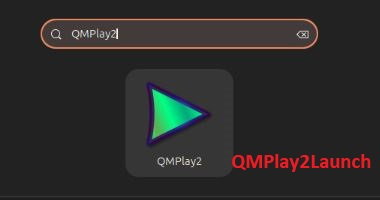

##### Method 2: Install QMPlay2 via Flatpak

Begin by installing Flatpak in your system.

```bash
sudo apt install flatpak
```

Then install GNOME Software Flatpak plugin to help the user install applications without needing the commandline.

```bash
sudo apt install gnome-software-plugin-flatpak
```

Next add the Flathub repository to access Flatpak applications.

```bash
flatpak remote-add --if-not-exists flathub https://dl.flathub.org/repo/flathub.flatpakrepo
```

Restart your system then install QMPlay2 with the command below.

```bash
sudo reboot
flatpak install flathub io.github.zaps166.QMPlay2 -y
```

Finally run the application.

```bash
flatpak run io.github.zaps166.QMPlay2
```

The command opens the User Interface as below.

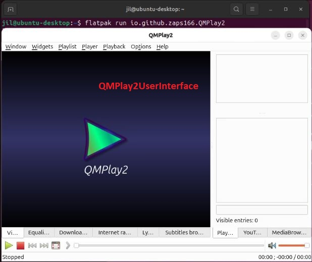

#### QMPlay2 Usage

To play a media file, drag and drop your file into the player or alternatively navigate to **Playlist** >> **Add** then select the location of your media file.

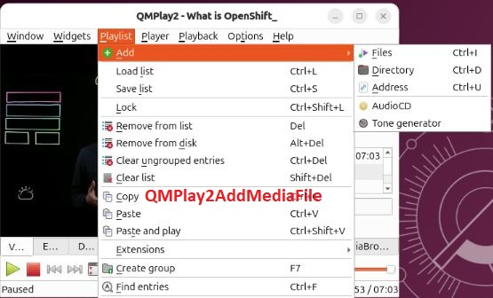

To stream a Youtube Video, navigate to YouTube Tab on the bottom right side and paste the YouTube link on the search tab and press enter.

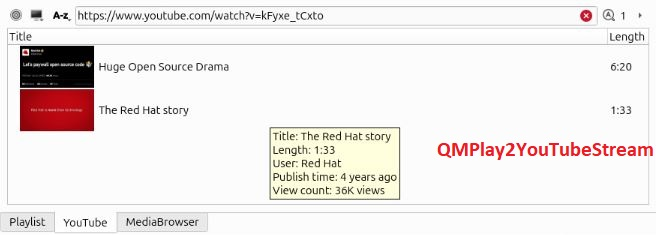

The menu has basic controls for playing video, pausing video, stopping video, playing next movie etc. The volume control is also accessible through the user interface or simply by using the mouse scroll.

The Playlist has various controls like loading a list of playlist, saving your preffered playlist, removing playlists, collapsing playlists and so on.

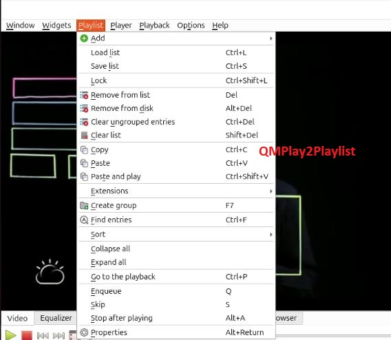

As seen in the introduction of the player, QMPlay2 supports Internet radios. To see the supported radio channels, navigate to Internet radios to see the list of all the supported radio channels.


QMPlay2 supports several Widgets.

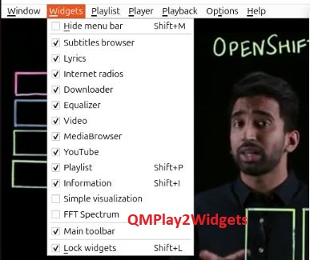

Read more on QMPlayer on the official [Github Page](https://github.com/zaps166/QMPlay2).

### 6. Kaffeine Media Player

Kaffeine is Unix-like media player developed and maintained by KDE with excellent support for digital TV (DVB). It has a user friendly interface and by default it uses libVLC media framework with support for GStreamer as well. A Mozilla plugin for the player exists to support streaming of content over the web. Kaffeine Media Player is written in C++ and is available in multiple languages. Having a Unix-like operating system, its licensed under GPL-2.0-or-later and supports use of MPlayer projects binary codecs for proprietary formats.

#### Features

Some key features associated with Kaffeine Media Player include the following.

- Supports digital TV (DVB-C/S/S2/T, ATSC, CI/CAM), DVD, Video CD and CD audio.

- Has an easy to use user interface.

- Supports Mozilla plugin for web streaming of content.

- Available in multiple languages.

#### Installation and Usage

Kaffeine Media Player can be installed using APT package manager as well as downloading it from Flathub.

##### Method 1: Install Kaffeine via Flatpak

To install Kaffeine via Flathub, follow the steps below.

###### Step 1 : Install Flatpak

Install Flatpak on Ubuntu with the command below.

```bash
sudo apt install flatpak
```

###### Step 2 : Install GNOME Software Flatpak plugin

The GNOME Software plugin makes it possible to install applications without the need for command line.

```bash
sudo apt install gnome-software-plugin-flatpak
```

###### Step 3 : Add the Flathub repository

Enable Flathub repository in your system to allow you access the Flatpak applications then restart your system.

```bash
flatpak remote-add --if-not-exists flathub https://dl.flathub.org/repo/flathub.flatpakrepo
```

###### Step 4 : Install Kaffeine Media Player

To install Kaffeine, simply run the command below.

```bash
sudo flatpak install flathub org.kde.kaffeine -y
```

###### Step 5 : Run Kaffeine Media Player

To launch the player, run the command below.

```bash
flatpak run org.kde.kaffeine
```

Kaffeine Media Player opens as below.

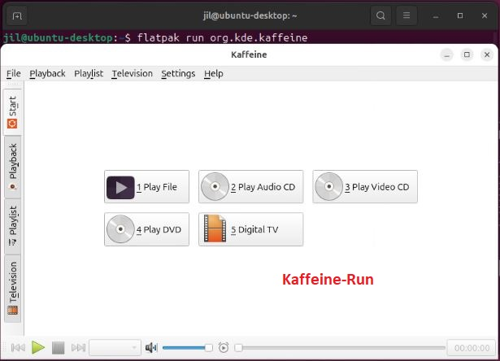

##### Method 2 : Install Kaffeine using APT package manager

Another method to install Kaffeine on Ubuntu is by the use of APT package manager.

###### Step 1 : Search the packages on APT Index

Run the commands below to check if Kaffeine packages available for installation exists in the APT Package index.

```bash
apt search kaffeine
apt-cache search kaffeine
```

###### Step 2 : Install Kaffeine on Ubuntu

Install the Kaffeine application on Ubuntu system.

```bash
sudo apt update 
sudo apt install kaffeine
```

The command will install all the dependencies needed to install Kaffeine in Ubuntu system as well as installing the application.

###### Step 3 : Launch Kaffeine application

Launch the application by navigating to **Applications Menu** >> **Show Apps** >> Search for **Kaffeine** 

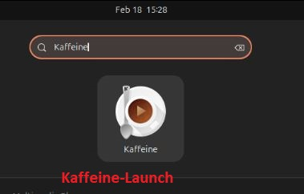 

Double-click the icon to launch the application.

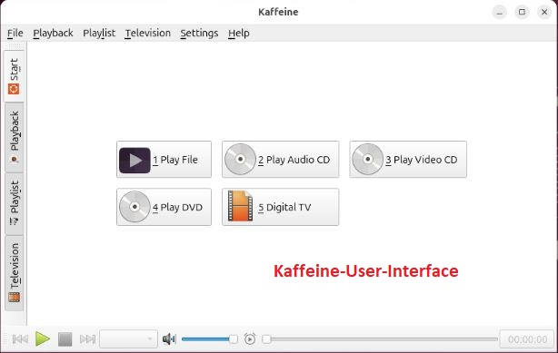

#### Kaffeine Media Player Usage

To play a video locally stored in your system, navigate to **File** >> **Open** >> then navigate to the location of your video.

To stream a video from internet, navigate to **File** >> **Open URL** then you are ptompted to *Enter a URL* 

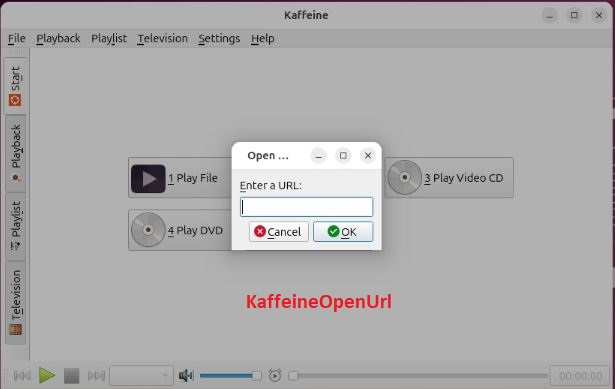

You could also play Audio CD, Video CD, play DVD, Open Recent files and also play DVD from a folder.

Under **Playback** you have options to Play the video in Minimal Mode or Full Screen Mode. In addition, you can add Subtitles and manage the Audio and Video. You can jump to a certain Position of a movie, skip a position, play a certain chapter etc.

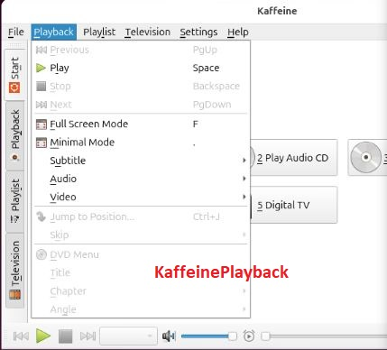

On the **Playlist** , the user can *add a New playlist* from a source, Rename a playlist, Remove a playlist, Save a playlist, save a random file as favorite for easier accessibility and save a Repeat Playlist.

On the **Television** tab, the user can configure his DVB card with Kaffeine to have his Channels and program guides.

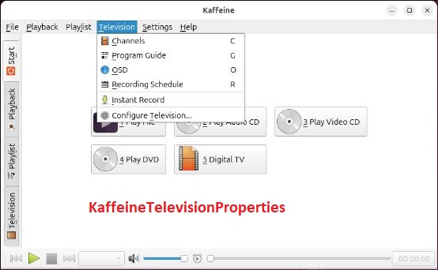

The volume is controlled via an equalizer while subtitles are loaded automatically as your video file is playing.

Read more on Kaffeine Media Player on the [Github Page](https://github.com/KDE/kaffeine).

### 7 : Audicious Media Player

Audicious Media Player is a lightweight, open source, versatile audio player that runs on Linux, BSD derivatives, macOS and Windows. Audicious Media Player doesnt compete for computer resources with other programs. It has an ultra modern Qt/GTK themed interface with Winamp Classic skins. 

During it's operations, the user easily drags and drops folders and individual song files to play them. 

#### Features

Features associated with Audicious Media Player include the following:-

- Open source, lightweight and versatile.

- The user is able to listen to CD or stream music from the web.

- Has a graphical equalizer to control and manage your sound.

- Supports multiple plugins to add functionality.

- It as cross platform in nature with ability to run across Linux, macOS and Windows.

- It utilises very minimal computer resources.

- Has an ultra modern Qt/GTK themed interface

- Has a vibrant community of users with active forums to help users with the issues they encounter as they use the player.

- It is very easy to install with already preconfigured packages.

#### Installation and Usage

Audicious and audicious plugins repositories are hosted on [Github](https://github.com/audacious-media-player)). Installation of Audicious on Ubuntu Desktop and its derivatives can be achieved by following the steps.

#### Method 1 : Install Audicious Media Player via APT

Audicious Media Player can be installed directly from APT package repositories by the command below. This is the recommended 

```bash
 sudo apt install audacious
```

This command installs all the dependencies required to install Audicious Media player  and Audacious plugins.

Launch the application by navigating to **Applications Manager** >> **Show Apps** >> Search for Audicious

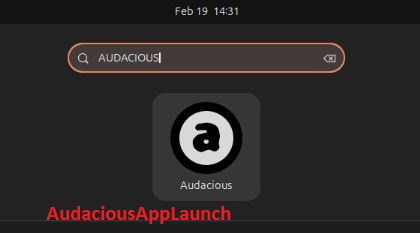

Double click the icon to open the user interface as below.

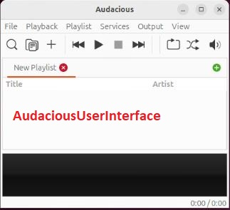

#### Method 2 : Install Audacious Media Player using Flatpak

Audacious Media Player can also be installed via Flatpak using the steps below.

###### Step 1 : Install Flatpak

If Flatpak is not already installed, run the command below to install it.

```bash
sudo apt install flatpak
```

###### Step 2 : Add Flathub repository

Enable Flathub repository in your system to allow you access the Flatpak applications then restart your system.

```bash
flatpak remote-add --if-not-exists flathub https://flathub.org/repo/flathub.flatpakrepo
sudo reboot
```

###### Step 3 : Install Audacious

Install Audacious Media Player with the command below.

```bash
sudo flatpak install flathub org.atheme.audacious -y
```

###### Step 4 : Launch Audacious

Launch Audacious with the command below.

```bash
audacious 
```


#### Usage

To Add a Music file navigate to **File** > **Open Files** then navigate to the location of your music file and select the file. To play a music file dfrom the web, navigate to **File** > **Open URL** and paste the link to the music file  from the web.


To see all the properties under Playback like play a music file, pause, stop, previous and so on, navigate to Playback and see a dropdown of the properties you can play with.

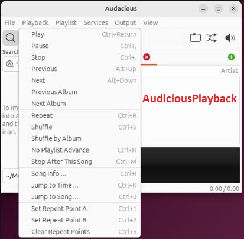

Under **Services**, the user can **play CD** or **Add CD**. From the Services the user could also explore the **Plugins** 


The user can control the *volume* of the music file by navigating to **Output** and then a list of all the properties like Volume Up, Volume Down, Equalizer, Effects and more.

Audacious also supports visualizations. Navigate to **View** > **Visualizations** 

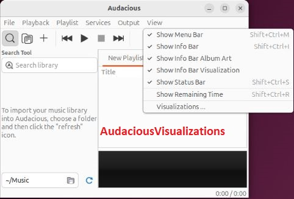

Audacious supports skins to help the user to change its appearance. The skins can be downloaded online and installed through the preferences. Navigate to **File** > **Settings** to access Audacious Settings.

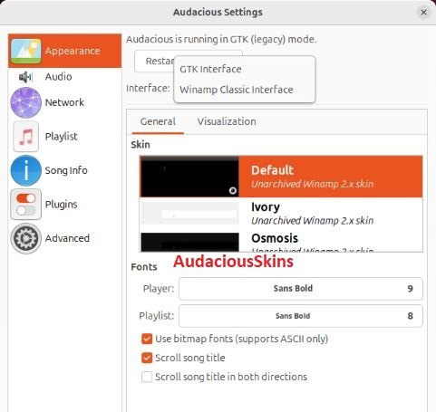

Read more about Audacious Media Player, navigate to [Audacious Github](https://github.com/audacious-media-player/audacious) Page.
