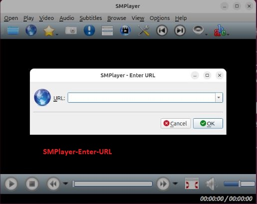

## Media Players / Video Editors

Media players are hardware or software devices used to play multimedia files e.g audio files, video files, image files and digital media files. These tools play files stored on a storage device, on a disc or streamed from the internet. 

Media players support various file formats e.g MP3, WAV, AVI,MP4 and many more with the ability to organise media files into music, videos and photos. This helps you to sort your files in your playlist. Media players allows the user to playback and control the progress of their file by starting, pausing, stopping, volume adjustment, fast fowarding, playbacks, subtitles etc.

Video Editors are software programs that transforms raw video footage into an organised story. Video editors helps you to crop, trim or split your video into small clips, adding enhancements etc and then allows you to download your editied video as an MP4 to save and share with others. Video editors also allow the user to remove unwanted background noise from scenes and upload their preffered music to the video. A good video editor should have the ability to add feel and animated effects to the editted video.

If you intend to create promotional, youtube tutorials, stories and educational videos, then you need to learn how to edit the videos as most often, you will need to trim your videos as well as adding effects to your videos.

This documentation will major around common media players and how to install them in Ubuntu Desktop and its derivatives.

### 1. MPV Media Player

MPV Media Player is completely free open source software that is cross-platform in nature for the command line. Its preffered by many users because of its ability to support a wide range of media file formats, audio, video codecs and subtitle types. It has powerful scripting capabilities which makes the player a Swiss amy knife as it can do almost anything.

MPV media player is based on OpenGL, Vulkan and D3D11 for high quality video output e.g color management, frame timing, interpolation, HDR. It is built in C programming language which makes it highly embeddable and easily integratable into other applications. 

MPV is purely commandline based but provides an On Screen Controller on top of the video for basic control. MPV leverages most hardware decoding APIs on all platforms its installed on.

MPV media player is based on MPlayer and mplayer2 and has special input URL types available to read input from several sources. It has a fully configurable command-driven control layer to allow the user to control MPV using the keyboard, mouse or remote control.

#### Features

As seen on the brief introduction, its sufficient to note that MPV Media Player is rich in features as summarised below.

- MPV media player is free and open source.

- Supports multiple video file formats, audio and video codecs.

- It is cross-platform in nature.

- The user can take screenshots using the screenshot input mode command on a currently played file. The default **S** takes screenshots without subtitles while **s** includes subtitles.

- MPV has a terminal status line that shows the playback status on the terminal. e.g V for video and A for audio, current time position, total file duration, playback speed, playback percentage, encoding state,  display sync state, dropped frames and cache state.

- MPV Media Player has the ability to reduce latency by disabling features which increase latency because it is optimized for normal video playback.

- MPV Media Player has the ability to store a playback of a currently playing file and resume to it the next time that file is played.

- MPV Media Player supports many network protocols but the protocol prefix must always be specified e.g HTTP, HTTPS, ytdl, smb, etc

- MPV Media Player has no official GUI but has the On Screen Controller which acts as pseudo GUI mode for minimal control over keyboard, mouse or remote control.

- Supports multiple audio output drivers e.g pulse, openal, audiounit for iOS, pipewire, sdl, wasapi etc.

- Supports multiple video output drivers e.g gpu, xv, direct3d, sdl etc

- Supports multiple audio filters that allows the user to modify the audio stream and its properties e.g lavcac3enc, tempo, pitch etc

- MVP Media Player also supports multiple video filters to help the user to modify the video stream and its properties e.g --vf, colormatrix etc

- Supports many encoding formats and codecs making it easy to encode files from one format/codec to another.

- MPV Media Player is controlled with commands and properties and the user can interact with the player using key bindings, OSD, JSON IPC, client API and the classic slave mode.

For more details on this amazing Media Player, please visit the [MPV Manual](https://mpv.io/manual/master/).

#### Installation and Usage

To install MPV Media Player on Ubuntu Desktop, follow the steps below.

##### Step 1 : Download MPV Media Player

Navigate to the [MPV Github releases](https://github.com/mpv-player/mpv/releases) page for the latest MPV media player release if you would wish to build the application from the source code.

The MPV media player packages are available in Ubuntu APT package index. The package can be searched using the commands below which will list for you the mpv packages available for installation.

```bash
apt search mpv
apt list | grep mpv
apt-cache search mpv
```

##### Step 2: Install MPV Media Player

MPV Media Player can be installed directly using the APT package manager. Navigate to your terminal and run the command below:

```bash
sudo apt install mpv
```

##### Step 3: Launch MPV Player

After successful installation, you can launch the application by navigating to **Application menu** >> **Activities** then search for **MPV Media Player** 


Alternatively you can launch MPV Media Player on the command terminal by the command below.

```bash
mpv
```

Launching MPV using the mpv command doesnt open anything as the command expects you to supply either the path to your video/audio file, URL and so on. We will examine this in the usage.

##### Step 4: MPV Media Player Usage

To stream a video/audio from URL source, copy the video/audio URL and launch it on the command terminal as shown below.

```bash
mpv <url to your video/audio>
## example ##
mpv https://www.youtube.com/watch?v=HEBvdSI0wGQ
```

This opens the video stream as below.


If the user desires to start the stream at a specific time, he can do this by running the command below.

```bash
mpv --start=120 https://www.youtube.com/watch?v=HEBvdSI0wGQ
```

The command above will start your stream at the second minute.


To loop through the video, run the command:

```bash
mpv --loop <your URL or /path/to/your/video.mp4
```

To play a video in full screen mode

```bash
mpv --fs /path/to/your/video.mp4
```

To adjust volume of the video

```bash
mpv --volume=75 /path/to/your/video.mp4
```

To see a list of options you can use with MPV Media Player

```bash
mpv --help
```

To play your audio file in the background as you work, add an ampersand at the end of the command.

```bash
mpv /path/to/audio.mp3 &
```

To read more about MPV Media Player, access the [MPV-Player Github page](https://github.com/mpv-player/mpv)

### 2. SMPlayer

SMPlayer is a free media player for Windows, Linux and Mac OS with built-in codecs which enables the player to play all video and audio formats without needing installation of other external codecs. SMPlayer distinguishes itself from other media players due to its capability to remember the settings of all the files you play on the player. 

SMPlayer is a GUI based with ability to play Youtube videos and download titles.

#### Features

SMPlayer distinguishes itself as key media player due to some of the features highlighted below.

- SMPlayer supports majority of the well known media formats e.g avi, mp4, mkv, mpeg, mov, divx, h.264 due to its built-in codecs.

- SMPlayer has support for Youtube with a plugin to help the user to search for Youtube videos.

- Supports several skins and icon themes to change the way player looks like.

- Has ability to search and download subtitles from open subtitles website.

- Supports video and audio filters.

- Ability to tweak the video/audio playback speed, audio adjustment and subtitle delays, video equalizer etc

- Available in multiple languages

- Available for Windows, Linux and Mac OS.

- SMPlayer is free and opensource licensed under GPL license.

- Uses MPlayer as its playback engine. 

#### Installation and Usage

SMPlayer source code is avaliable for Downloads on the official [SMPlayer Downloads page](https://www.smplayer.info/en/downloads) which maintains packages for Windows, Linux and Mac OS. 

To install SMPlayer on Ubuntu Desktop, carryout the steps below. The latest releases for SMPlayer are versioned at SMPlayer official [Github page](https://github.com/smplayer-dev/smplayer/releases). 

##### Step 1 : Add the SMPlayer repository

To easily install and manage the SMPlayer on Ubuntu, you need to add the official SMPlayer repositories on your system. This also helps to include some missing and updated libraries that might not already exist in the prebuilt SMPlayer libraries. Run the command below.

```bash
sudo add-apt-repository ppa:rvm/smplayer 
```

Note : The official repository might not be supported in latest version of Ubuntu distributions i.e from **Ubuntu 24.XX** 

Then update your system for the new changes to be effected.

```bash
sudo apt -y update 
```

If the method above throws an error, then remove the PPA and install SMPlayer directly from the packages maintained in the APT package index.

```bash
sudo add-apt-repository --remove ppa:rvm/smplayer
```

##### Step 2 : Install SMPlayer on Ubuntu

SMPlayer media player packages are available for installation on Ubuntu's APT package index. To install SMPlayer on Ubuntu Desktop, execute the following command.

```bash
sudo apt install smplayer smplayer-themes
```

##### Step 3: Launch SMPlayer on Ubuntu

To launch SMPlayer on Ubuntu navigate to **Applications Menu** >> **Show Apps** >> Search for **SMPlayer** 

Alternatively using the command prompt issue the command.

```bash
smplayer
```


##### Step 4 : SMPlayer Usage

To open your video/audio file, navigate to the **Menu** >> **Open** >> **File** to navigate to where your video/audio file is located. You could also drag-and-drop the file to the player to play it.

When playing your video/audio file, you can **Pause**, **Stop** and even play the **Next** or **Previous**. To Stop the file, you can press **S** on the command line.

As your Video/audio file is playing, you can control the volume by the volume slider using your mouse, or alternatively use the scroll wheel on your mouse. You could also use keyboard shortcuts i.e **+/-** or **Up/Down** to adjust the volume of the file you are playing.

To jump to a specific part of your video/audio file, you can use the **seek bar** or keyboard shortcuts like **Left/Right** arrows or **PgUp/PgDn** 

If the video you are watching is on a language you dont understand, you can load subtitles by navigating to **Subtitles** >> **Load Subtitle File** 

You can create a playlist by adding multiple files by navigating to **Open** >> **File** then browsing to the location of your multiple files. The Playlist can then be managed on **Playlist** menu options.


The video Aspect ration can be adjusted from **Video** >> **Aspect ratio**. To play video with old formats, navigate to **Video** >> **Deinterlace** 


To stream your favorite audio/video from Youtube, copy the file URL and navigate to **Open** >> **URL** and paste the URL link.



To take the screenshots from your playing video, **press Ctrl + S**. To watch your video in **Full Screen Mode**, go to **Video** then **Fullscreen** or by simply pressing **F** on the keyboard.


To view a video from Youtube video, navigate to **View** >> **YouTube browser**


To read more on SMPlayer, navigate to SMPlayer [Github Page ](https://github.com/smplayer-dev/smplayer) 

### 3. Gnome Videos

The official media player for the GNOME desktop environment is Gnome Videos formerly known as Totem. This player uses Clutter and GTK+ toolkits. All GNOME versions from 2.10 has the player included by default making it the defacto media player for all GNOME desktop environments. For playback, Videos uses GStreamer framework or can be configured to use Xine libraries instead of GStreamer. The developers have enhanced GStreamer to be the core framework for playback services in Gnome Videos dropping the support for Xine backend.

Videos automatically gathers all your videos in one place and all the user has to do is pick his movie and play it. Another key feature is the players ability to group several video channels making the accessibility of your videos very easy. Additionally, the media player has an easy to use user interface. 

#### Features

Some of the features associated with Gnome Videos are highlighted below.

- GStreamer allows Gnome Videos to support a large number media formats.

- The Gnome Videos configured to use Xine has a better encrypted DVD playback support and DVD navigation support.

- Its easily integrated with GNOME desktop environment and its file manager i.e GNOME files.

- Supports a huge number of plugins which allows the player to support multiple media formats.

- Supports multiple playlist formats e.g M3U, XSPF, SMIL, Windows Media Player playlists, RealAudio etc.

- Supports Full-screen video playback with ability to control the video brightness, contrast and saturation.

- Supports stereophonic sound.

- Could also be supported remotely on computers with an infrared port using LIRC.

- Supports loading of external subtitles manually or automatically using the command line interface.

- Has an easy to use interface.

- Supports direct playback from online video channels

- Supports multiple video decoding mechanisms e.g UVD, PureVideo, QuickSync etc for video acceleration. 

#### Installation and Usage

Gnome Videos package is available for installation from the APT package index. To install the media player carryout the following steps.

##### Method 1 : Install Gnome Videos via Flathub

Flathub is a centralised repository that contains multiple software that Linux users can install in their distributions. 

To use Flathub, you must install it in your system first if not already installed.

```bash
sudo apt install flatpak
```

Add the Flathub repository.

```bash
 sudo flatpak remote-add --if-not-exists flathub https://flathub.org/repo/flathub.flatpakrepo
```

For a GUI to manage Flatpak applications, you can **optionally** install GNOME Software plugin.

```bash
sudo apt install gnome-software-plugin-flatpak
sudo reboot 
```

Search for the application in the Flathub repository

```bash
sudo flatpak search totem
```

Install the Gnome Videos application

```bash
sudo flatpak install flathub org.gnome.Totem
```

Agree with the onscreen prompts to install the application. Once the installation is complete, run GNOME Videos by the command below.

```bash
flatpak run org.gnome.Totem
```

The interface looks like this.


